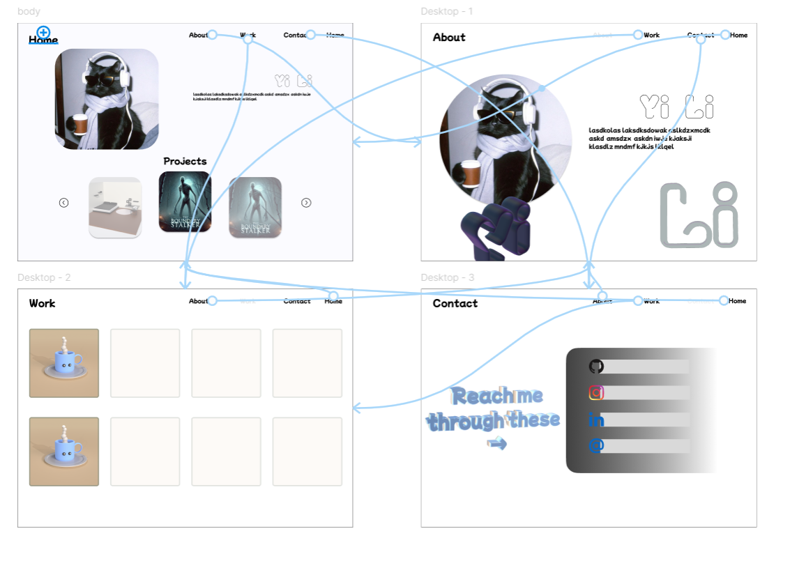
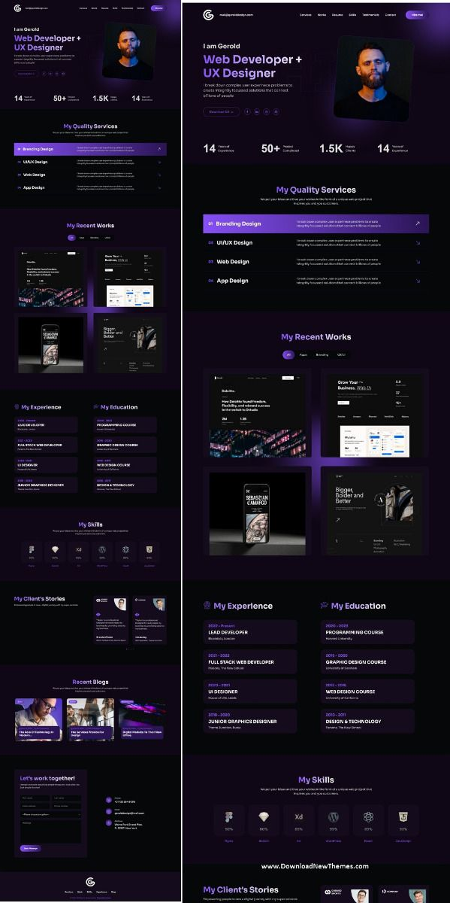

# Final Proposal

Continuing my personal Website/portfolio that showcases the works I've done. 

### HTML/JS/CSS
- create animations; possibly using keyframes and function events
- creating image popups using JS `onclick` events
- making buttons that transitions between `img` using JS with `onclick` and maybe `arrays`
- making links for contact informations; making email link function as intended

### Other (Possibility)
- Adding some sort of elements to fill in the vast white space

## Visual Idea

## Inspiration:
